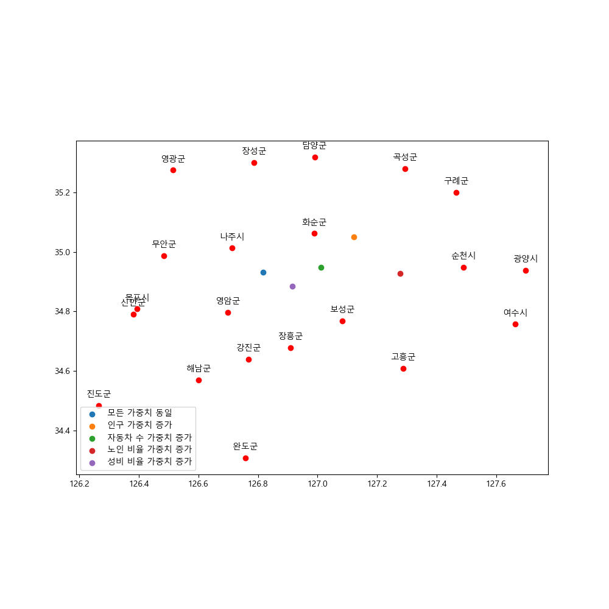

# Best Hospital Location in Jeollanam-do 

## Project Overview

This project aims to conduct a comprehensive analysis of social service data, focusing on Jeollanam-do, an area known to have the highest proportion of elderly population in South Korea. Given the growing aging problem in this region, it's critical to understand how social services are guaranteed, and to identify potential improvements to current policies.

We've taken inspiration from the report titled "Social Services: Current Status and Policy Implications" authored by Ahn Soo-ran, an associate researcher at the Korea Institute for Health and Social Affairs. While this report indicates that the Ministry of Health and Welfare's initiatives make up a significant proportion of all social services, there's a need to dive deeper into the situation in Jeollanam-do, specifically.

This project specifically focuses on hospital location selection in Jeollanam-do. We aim to identify the optimal hospital location considering factors such as population distribution, gender ratio, and topography. The goal is to propose a direction for enhancing hospital infrastructure in Jeollanam-do.

## How to Use the Analysis Source

Please follow the steps below to use our Python source for social data analysis and hospital location selection:

1. Install Python and the necessary libraries.
2. Navigate to the project directory (./social_data_analysis/hospital_analysis_source_file).
3. Run the main.py file with a desired weight argument, i.e., `python main.py {desired weight}`.
4. Review the resulting output for insights and recommendations on the optimal hospital location.

